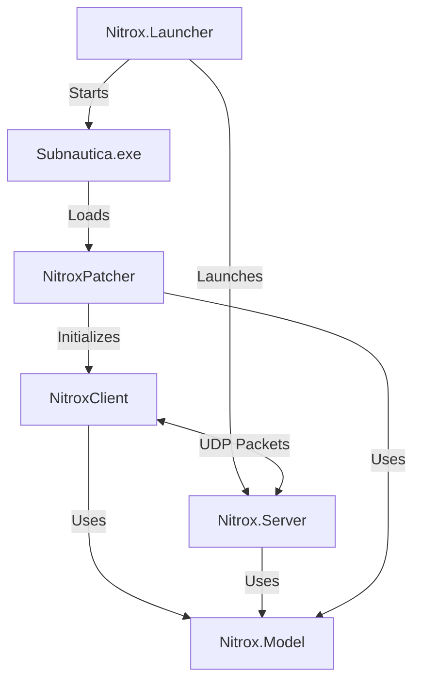

Nitrox Unlocked is built with a modular architecture that separates concerns between the launcher, server, client, patcher, and shared model components. This design enables clean separation of multiplayer logic from the base game while maintaining flexibility for both persistent and dynamic runtime modifications.

## Project Structure

The codebase is organized into several key projects:

### Core Components

<CardGroup cols={2}>
  <Card title="Nitrox.Launcher" icon="rocket">
    Desktop application built with Avalonia UI that manages game installation, server launching, and configuration. Serves as the entry point for users.
  </Card>
  
  <Card title="NitroxPatcher" icon="wrench">
    Harmony-based patching system that modifies Subnautica's runtime behavior. Injects into the game process and applies both persistent and dynamic patches.
  </Card>
  
  <Card title="NitroxClient" icon="user">
    Client-side multiplayer logic including networking, game state synchronization, and player interaction handling.
  </Card>
  
  <Card title="Nitrox.Server.Subnautica" icon="server">
    Dedicated server application that manages multiplayer sessions, world state, and player coordination.
  </Card>
</CardGroup>

### Shared Libraries

<CardGroup cols={2}>
  <Card title="Nitrox.Model" icon="box">
    Core data structures, networking primitives, and shared abstractions used across all components.
  </Card>
  
  <Card title="Nitrox.Model.Subnautica" icon="gamepad">
    Subnautica-specific packet definitions, game logic models, and data structures.
  </Card>
</CardGroup>

## Component Relationships

The components interact in a layered architecture:



### Initialization Flow

<Steps>
  <Step title="Launcher Starts">
    User launches Nitrox.Launcher, which validates the Subnautica installation and configuration.
  </Step>
  
  <Step title="Game Process Injection">
    Launcher starts Subnautica with `--nitrox` parameter pointing to Nitrox libraries location.
  </Step>
  
  <Step title="Patcher Execution">
    NitroxPatcher's `Main.Execute()` is called as the game's entry point (NitroxPatcher/Main.cs:60).
  </Step>
  
  <Step title="Dependency Resolution">
    Custom AssemblyResolve handler loads Nitrox DLLs from the launcher directory (NitroxPatcher/Main.cs:150).
  </Step>
  
  <Step title="Patch Application">
    Persistent patches are applied immediately; dynamic patches wait for multiplayer session start (NitroxPatcher/Patcher.cs:122).
  </Step>
  
  <Step title="Client Initialization">
    NitroxClient components are registered via dependency injection and NitroxBootstrapper MonoBehaviour is attached (NitroxPatcher/Patcher.cs:151).
  </Step>
</Steps>

## Data Flow

### Client to Server Communication

```
Game Event → Harmony Patch → Packet Creation → UDP Send → Server Processing
```

**Example: Base Deconstruction**

1. Player deconstructs a base piece in Subnautica
2. `BaseDeconstructable_Deconstruct_Patch` intercepts the call (NitroxPatcher/Patches/Dynamic/BaseDeconstructable_Deconstruct_Patch.cs:67)
3. Patch creates `PieceDeconstructed` packet with base ID and piece identifier
4. Packet is serialized using BinaryPack and sent via UDP
5. Server receives packet, updates world state, and broadcasts to other players

### Server to Client Communication

```
Server Event → Packet Broadcast → Client Receives → Packet Processor → Game State Update
```

**Example: Chat Message**

1. Server receives chat message from player A
2. Server creates `ChatMessage` packet (Nitrox.Model.Subnautica/Packets/ChatMessage.cs:7)
3. Packet is broadcast to all connected clients
4. Each client's `PacketReceiver` queues the packet (NitroxClient/Communication/PacketReceiver.cs)
5. Corresponding packet processor updates the UI with the new message

## Dependency Injection

Nitrox uses Autofac for dependency injection:

- **NitroxPatcher**: Uses `NitroxPatchesModule` for patch discovery (NitroxPatcher/Patcher.cs:147)
- **NitroxClient**: Uses `ClientAutoFacRegistrar` for service registration (NitroxPatcher/Patcher.cs:105)
- **Server**: Uses `SubnauticaServerAutoFacRegistrar` for server-side services

Patches can resolve dependencies using the `Resolve<T>()` method:

```csharp
Resolve<IPacketSender>().Send(new BaseDeconstructed(baseId, ghostEntity));
```

<Note>
Dependency injection is initialized in `Patcher.Initialize()` before any patches are applied, ensuring all components have access to required services.
</Note>

## Project References

The dependency graph prevents circular references:

```
Nitrox.Launcher
  ├─ Nitrox.Model
  └─ Nitrox.Model.Subnautica

NitroxPatcher
  ├─ Nitrox.Model
  ├─ Nitrox.Model.Subnautica
  └─ NitroxClient

NitroxClient
  ├─ Nitrox.Model
  └─ Nitrox.Model.Subnautica

Nitrox.Server.Subnautica
  ├─ Nitrox.Model
  └─ Nitrox.Model.Subnautica
```

## Build Configuration

All projects share common build properties via:

- **Directory.Build.props**: Shared MSBuild properties (C# version, nullable reference types, etc.)
- **Directory.Build.targets**: Custom build targets including Subnautica DLL references
- **Directory.Packages.props**: Centralized NuGet package version management
- **Nitrox.Shared.props** & **Nitrox.Shared.targets**: Nitrox-specific build configuration

<Warning>
The build system automatically references Subnautica's assemblies from the game installation directory. Ensure your Subnautica path is correctly configured in the launcher.
</Warning>

## Next Steps

<CardGroup cols={2}>
  <Card title="Patching System" icon="code" href="/development/patching-system">
    Learn how Harmony patches modify Subnautica's behavior
  </Card>
  
  <Card title="Networking" icon="network-wired" href="/development/networking">
    Understand the UDP-based packet system
  </Card>
</CardGroup>