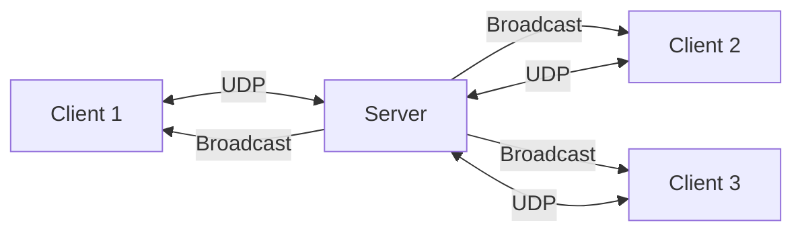

Nitrox uses a custom UDP-based networking layer built on [LiteNetLib](https://github.com/RevenantX/LiteNetLib) for fast, reliable multiplayer communication. The system is designed for low-latency synchronization of game state between the server and multiple clients.

## Network Architecture

### Transport Layer: UDP with LiteNetLib

Nitrox uses UDP instead of TCP for performance reasons:

- **Lower Latency**: No TCP handshake overhead
- **Unreliable Delivery**: Optional for non-critical updates (player positions)
- **Ordered Delivery**: Available when needed (building construction)
- **Reliable Delivery**: Available for critical events (inventory changes)

```csharp
// NitroxClient/Communication/NetworkingLayer/LiteNetLib/LiteNetLibClient.cs:50
client = new NetManager(listener)
{
    UpdateTime = 15,  // Poll network every 15ms
    ChannelsCount = (byte)typeof(Packet.UdpChannelId).GetEnumValues().Length,
    IPv6Enabled = true,
    DisconnectTimeout = 300000  // 5 min timeout in DEBUG
};
```

<Note>
The network is polled every game tick via `PollEvents()` to process incoming packets and maintain connection state.
</Note>

### Client-Server Model



The server acts as the authoritative source of truth:
- Clients send actions to the server
- Server validates and applies changes to world state
- Server broadcasts updates to all connected clients
- Clients apply updates from server, never directly from other clients

## Packet System

### Base Packet Class

All packets inherit from the abstract `Packet` class:

```csharp
// Nitrox.Model/Packets/Packet.cs:14
[Serializable]
public abstract class Packet
{
    [IgnoredMember]
    public NitroxDeliveryMethod.DeliveryMethod DeliveryMethod { get; protected set; } 
        = NitroxDeliveryMethod.DeliveryMethod.RELIABLE_ORDERED;

    [IgnoredMember]
    public UdpChannelId UdpChannel { get; protected set; } = UdpChannelId.DEFAULT;
    
    public enum UdpChannelId : byte
    {
        DEFAULT = 0,
        MOVEMENTS = 1,  // Separate channel for position updates
    }

    public byte[] Serialize()
    {
        return BinaryConverter.Serialize(new Wrapper(this));
    }

    public static Packet Deserialize(byte[] data)
    {
        return BinaryConverter.Deserialize<Wrapper>(data).Packet;
    }
}
```

### Delivery Methods

Nitrox supports multiple delivery guarantees:

```csharp
// Nitrox.Model/Networking/NitroxDeliveryMethod.cs:6
public enum DeliveryMethod : byte
{
    /// <summary>
    /// Unreliable but in-order. Drops old packets if newer ones arrive.
    /// Use for: Player movement, rotation updates
    /// </summary>
    UNRELIABLE_SEQUENCED,
    
    /// <summary>
    /// Guaranteed delivery, any order.
    /// Use for: Independent events
    /// </summary>
    RELIABLE_UNORDERED,
    
    /// <summary>
    /// Guaranteed delivery, in-order.
    /// Use for: Most game events (default)
    /// </summary>
    RELIABLE_ORDERED,
    
    /// <summary>
    /// Guaranteed delivery, only latest packet matters.
    /// Use for: State synchronization
    /// </summary>
    RELIABLE_ORDERED_LAST,
}
```

<Warning>
Choose the appropriate delivery method for your packet type. Using `RELIABLE_ORDERED` for high-frequency updates (like movement) can cause network congestion.
</Warning>

### Creating a Packet

Packets are simple serializable data classes:

```csharp
// Nitrox.Model.Subnautica/Packets/ChatMessage.cs:7
[Serializable]
public class ChatMessage : Packet
{
    public ushort PlayerId { get; }
    public string Text { get; }
    public const ushort SERVER_ID = ushort.MaxValue;

    public ChatMessage(ushort playerId, string text)
    {
        PlayerId = playerId;
        Text = text;
        
        // Chat messages are important but order matters
        DeliveryMethod = NitroxDeliveryMethod.DeliveryMethod.RELIABLE_ORDERED;
        UdpChannel = UdpChannelId.DEFAULT;
    }
}
```

**Packet naming conventions**:
- Use descriptive names: `PieceDeconstructed`, `PlayerMovement`, `ChatMessage`
- Past tense for events that already happened
- Present tense for commands: `BuildingResyncRequest`

## Serialization with BinaryPack

Packets are serialized using [BinaryPack](https://github.com/Sergio0694/BinaryPack) for efficiency:

### Automatic Serialization

BinaryPack automatically handles:
- Primitive types (int, float, string, etc.)
- Collections (List, Dictionary, Array)
- Nested objects
- Inheritance hierarchies

### Union Types

Polymorphic packet types are registered as unions:

```csharp
// Nitrox.Model/Packets/Packet.cs:40
static IEnumerable<Type> FindUnionBaseTypes() => FindTypesInModelAssemblies()
    .Where(t => t.IsAbstract && !t.IsSealed && (!t.BaseType?.IsAbstract ?? true));

foreach (Type type in FindUnionBaseTypes())
{
    BinaryConverter.RegisterUnion(type, 
        FindTypesInModelAssemblies()
            .Where(t => type.IsAssignableFrom(t) && !t.IsAbstract)
            .OrderByDescending(t => /* inheritance depth */);
}
```

This allows deserializing abstract packet types to their concrete implementations.

<Note>
Packet serialization is initialized once at startup via `Packet.InitSerializer()`. All packet types in `Nitrox.Model` and `Nitrox.Model.Subnautica` assemblies are automatically discovered.
</Note>

## Client-Side Networking

### Connecting to Server

```csharp
// NitroxClient/Communication/NetworkingLayer/LiteNetLib/LiteNetLibClient.cs:61
public async Task StartAsync(string ipAddress, int serverPort)
{
    Log.Info("Initializing LiteNetLibClient...");

    await Task.Run(() =>
    {
        client.Start();
        client.Connect(ipAddress, serverPort, "nitrox");
    }).ConfigureAwait(false);

    connectedEvent.WaitOne(2000);  // Wait up to 2s for connection
    connectedEvent.Reset();
}
```

### Sending Packets

```csharp
// NitroxClient/Communication/NetworkingLayer/LiteNetLib/LiteNetLibClient.cs:77
public void Send(Packet packet)
{
    byte[] packetData = packet.Serialize();
    dataWriter.Reset();
    dataWriter.Put(packetData.Length);  // Length prefix
    dataWriter.Put(packetData);         // Packet data

    networkDebugger?.PacketSent(packet, dataWriter.Length);
    client.SendToAll(dataWriter, 
                     (byte)packet.UdpChannel, 
                     NitroxDeliveryMethod.ToLiteNetLib(packet.DeliveryMethod));
}
```

**Usage in patches**:

```csharp
Resolve<IPacketSender>().Send(new PieceDeconstructed(
    baseId, pieceId, cachedPieceIdentifier, ghostEntity, baseData, operationId
));
```

### Receiving Packets

```csharp
// NitroxClient/Communication/NetworkingLayer/LiteNetLib/LiteNetLibClient.cs:99
private void ReceivedNetworkData(NetPeer peer, NetDataReader reader, 
                                  byte channel, DeliveryMethod deliveryMethod)
{
    int packetDataLength = reader.GetInt();
    byte[] packetData = ArrayPool<byte>.Shared.Rent(packetDataLength);
    
    try
    {
        reader.GetBytes(packetData, packetDataLength);
        Packet packet = Packet.Deserialize(packetData);
        packetReceiver.Add(packet);  // Queue for processing
        networkDebugger?.PacketReceived(packet, packetDataLength);
    }
    finally
    {
        ArrayPool<byte>.Shared.Return(packetData, true);
    }
}
```

<Note>
Packets are queued in `PacketReceiver` and processed on the Unity main thread to safely interact with game objects.
</Note>

## Server-Side Networking

### Server Initialization

```csharp
// Nitrox.Server.Subnautica/Models/Communication/LiteNetLibServer.cs
public class LiteNetLibServer
{
    private readonly NetManager server;
    private readonly EventBasedNetListener listener;

    public LiteNetLibServer(int port)
    {
        listener = new EventBasedNetListener();
        listener.ConnectionRequestEvent += OnConnectionRequest;
        listener.PeerConnectedEvent += OnPeerConnected;
        listener.PeerDisconnectedEvent += OnPeerDisconnected;
        listener.NetworkReceiveEvent += OnNetworkReceive;

        server = new NetManager(listener)
        {
            ChannelsCount = (byte)typeof(Packet.UdpChannelId).GetEnumValues().Length,
            IPv6Enabled = true
        };

        server.Start(port);
    }
}
```

### Broadcasting to Clients

The server can broadcast packets to all clients or specific targets:

```csharp
// Broadcast to all
public void BroadcastToAll(Packet packet)
{
    byte[] data = packet.Serialize();
    foreach (var peer in server.ConnectedPeerList)
    {
        peer.Send(data, packet.UdpChannel, packet.DeliveryMethod);
    }
}

// Send to specific player
public void SendToPlayer(Packet packet, ushort playerId)
{
    NitroxConnection connection = GetConnection(playerId);
    connection.Send(packet);
}
```

## Packet Processing

### Packet Processors

Each packet type has a corresponding processor on the client and server:

```csharp
// Client-side processor
public class ChatMessageProcessor : ClientPacketProcessor<ChatMessage>
{
    public override void Process(ChatMessage packet)
    {
        // Update UI with chat message
        if (packet.PlayerId == ChatMessage.SERVER_ID)
        {
            AddPlayerChatMessage("SERVER", packet.Text, Color.yellow);
        }
        else
        {
            Player player = playerManager.GetPlayer(packet.PlayerId);
            AddPlayerChatMessage(player.Name, packet.Text, Color.white);
        }
    }
}
```

### Processing Pipeline

```
Packet Received → Deserialized → Queued → Main Thread → Processor.Process() → Game State Updated
```

<Steps>
  <Step title="Network Thread Receives Data">
    LiteNetLib listener receives UDP packet data.
  </Step>
  
  <Step title="Packet Deserialization">
    BinaryPack deserializes bytes to concrete packet type.
  </Step>
  
  <Step title="Queue on Main Thread">
    Packet is queued in `PacketReceiver` for processing on Unity's main thread.
  </Step>
  
  <Step title="Processor Execution">
    Appropriate `PacketProcessor<T>` handles the packet and updates game state.
  </Step>
</Steps>

## UDP Channels

Nitrox uses separate UDP channels to prevent head-of-line blocking:

```csharp
public enum UdpChannelId : byte
{
    DEFAULT = 0,    // Most game events
    MOVEMENTS = 1,  // Player position/rotation updates
}
```

Movement packets on a separate channel ensure they don't get blocked waiting for building construction packets.

## Network Debugging

Nitrox includes built-in network debugging tools:

### Packet Debugger Interface

```csharp
public interface INetworkDebugger
{
    void PacketSent(Packet packet, int length);
    void PacketReceived(Packet packet, int length);
}
```

### Logging Network Traffic

```csharp
networkDebugger?.PacketSent(packet, dataWriter.Length);
```

This allows tracking:
- Packet types and frequency
- Bandwidth usage per packet type
- Latency measurements
- Packet loss detection

## Connection State Management

Clients go through several connection states:

```csharp
public enum ConnectionState
{
    Disconnected,
    Connecting,
    Connected,
    InGame,
}
```

### Connection Flow

<Steps>
  <Step title="Disconnected">
    Initial state. Client is not connected to any server.
  </Step>
  
  <Step title="Connecting">
    Client has initiated connection but not yet received server acknowledgment.
  </Step>
  
  <Step title="Connected">
    UDP connection established, negotiating session parameters.
  </Step>
  
  <Step title="InGame">
    Fully synchronized and actively playing in the multiplayer session.
  </Step>
</Steps>

## Clock Synchronization

Multiplayer games require synchronized time across clients:

```csharp
// NitroxClient/Communication/NetworkingLayer/LiteNetLib/ClockSyncProcedure.cs
public class ClockSyncProcedure
{
    public async Task<long> GetServerTimeDelta()
    {
        // Send multiple ping requests
        // Calculate round-trip time
        // Estimate server clock offset
        // Return delta for local clock correction
    }
}
```

**Usage**:
- Synchronize timed events (Aurora explosion)
- Coordinate player actions
- Prevent time-based desync

<Note>
Nitrox uses Network Time Protocol (NTP) concepts to maintain sub-second time synchronization between server and clients.
</Note>

## Performance Considerations

### Bandwidth Optimization

<AccordionGroup>
  <Accordion title="Use appropriate delivery methods">
    ```csharp
    // Good: Unreliable for frequent, non-critical updates
    public class PlayerMovement : Packet
    {
        public PlayerMovement()
        {
            DeliveryMethod = DeliveryMethod.UNRELIABLE_SEQUENCED;
            UdpChannel = UdpChannelId.MOVEMENTS;
        }
    }

    // Bad: Reliable ordered for movement
    DeliveryMethod = DeliveryMethod.RELIABLE_ORDERED; // Causes congestion!
    ```
  </Accordion>
  
  <Accordion title="Batch related updates">
    Instead of sending individual item updates, batch them:
    ```csharp
    public class InventoryUpdate : Packet
    {
        public List<ItemChange> Changes { get; }
    }
    ```
  </Accordion>
  
  <Accordion title="Delta compression for state">
    Only send changed values, not entire state:
    ```csharp
    public class PlayerStateUpdate : Packet
    {
        public Optional<Vector3> Position { get; }  // Only if changed
        public Optional<float> Health { get; }      // Only if changed
    }
    ```
  </Accordion>
</AccordionGroup>

### Latency Handling

The client tracks latency for UI display and prediction:

```csharp
listener.NetworkLatencyUpdateEvent += (peer, _) =>
{
    LatencyUpdateCallback?.Invoke(peer.RemoteTimeDelta);
};
```

## Common Networking Patterns

### Request-Response Pattern

```csharp
// Client sends request
Resolve<IPacketSender>().Send(new BuildingResyncRequest(baseId));

// Server responds with data
public class BuildingResyncRequestProcessor : ServerPacketProcessor<BuildingResyncRequest>
{
    public override void Process(BuildingResyncRequest packet, Player player)
    {
        BaseData baseData = GetBaseData(packet.BaseId);
        player.SendPacket(new BuildingResync(baseData));
    }
}
```

### Broadcast Pattern

```csharp
// Server receives event from one client
public override void Process(ChatMessage packet, Player sender)
{
    // Broadcast to all players including sender
    server.BroadcastToAll(packet);
}
```

### Authority Pattern

```csharp
// Client requests action
Resolve<IPacketSender>().Send(new ConstructPiece(baseId, pieceData));

// Server validates and authorizes
public override void Process(ConstructPiece packet, Player player)
{
    if (!ValidateConstruction(packet))
    {
        player.SendPacket(new ConstructionDenied(packet.PieceId));
        return;
    }
    
    ApplyConstruction(packet);
    server.BroadcastToAll(new PieceConstructed(packet));
}
```

## Next Steps

<CardGroup cols={2}>
  <Card title="Patching System" icon="code" href="/development/patching-system">
    Learn how to send packets from Harmony patches
  </Card>
  
  <Card title="Contributing" icon="code-branch" href="/development/contributing">
    Ready to contribute? Read our contribution guidelines
  </Card>
</CardGroup>